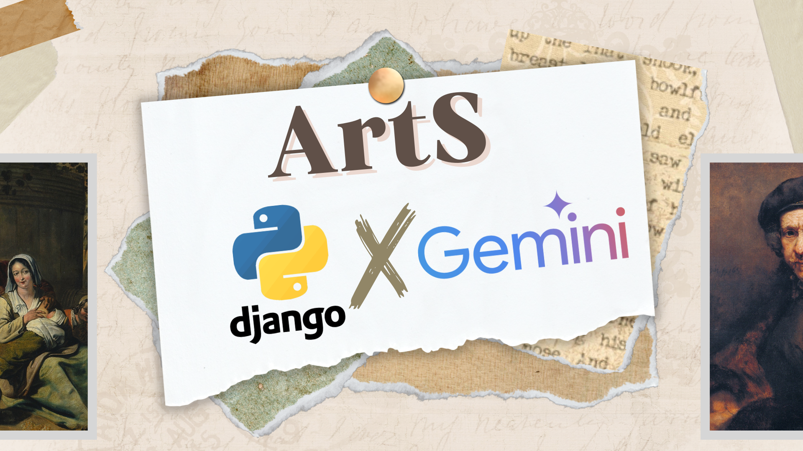

# ArtS : Développement d'une Application Culturelle Innovante



ArtS est une plateforme culturelle regroupant des galeries d'art, tableaux, expositions, réservations et avis, catalogues, ateliers culturels, événements culturels et un gestionnaire d'images. Son objectif est de rendre l’art et la culture accessibles grâce à une expérience utilisateur enrichie, soutenue par des fonctionnalités avancées d'intelligence artificielle.

## Technologies Utilisées

- **Langage :** Python
- **Intelligence Artificielle :** IA Gemini
- **Base de Données :** MySQL
- **API :** Utilisation d'API pour diverses fonctionnalités
- **Gestion de Versions :** Git
- **Méthodologie :** Scrum

## Fonctionnalités IA de Gemini Intégrées

L'IA Gemini joue un rôle clé dans cinq fonctionnalités du projet :

- **Recommandation IA d'œuvres d'art :** Suggestions de tableaux et images similaires à partir d'une image donnée.
- **Génération d'images :** Création d'images basées sur un texte fourni par l'utilisateur.
- **Description IA d'images :** Analyse et description détaillée des images fournies.
- **Chatbot intelligent :** Support interactif et informatif sur la plateforme.
- **Générateur de programme d'ateliers :** Suggestions personnalisées d'ateliers culturels.

Le projet se divise en deux parties : une interface administrateur pour la gestion des contenus et une interface utilisateur frontale.

## Étapes de Configuration pour le Développement

1. **Commandes de Migration :**

   - Pour créer les migrations de base de données :

    ```bash
    python manage.py makemigrations
    ```

   - Pour appliquer les migrations :

    ```bash
    python manage.py migrate
    ```

2. **Création d'un Super Utilisateur :**

   Pour accéder au tableau de bord admin, créez un super utilisateur avec :

    ```bash
    python manage.py createsuperuser
    ```

3. **Lancer le Projet Globalement :**

   Pour démarrer le serveur de développement et tester l'application :

    ```bash
    python manage.py runserver
    ```

4. **Exécution des Services IA :**

   - **Image Describer :**
    ```bash
    streamlit run vision.py --server.enableXsrfProtection false
    ```
   - **Chatbot :**
    ```bash
    streamlit run app.py --server.port=8502
    ```
   - **Image Generator :**
    ```bash
    streamlit run vision.py --server.port=8503
    ```

## Contributeurs

Les personnes suivantes ont contribué au développement d'ArtS :

- Mohamed Wassim Ennar
- Nidhal Ennar
- Said Atoui
- Ahmed Gamgami
- Nabli Arij

## Contact

Pour plus de détails ou contributions, contactez les contributeurs via le dépôt GitHub.
